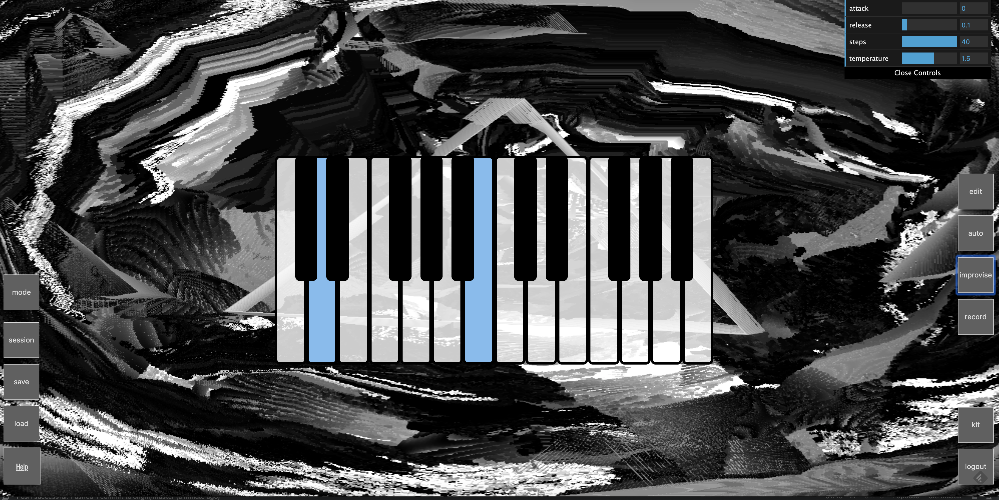
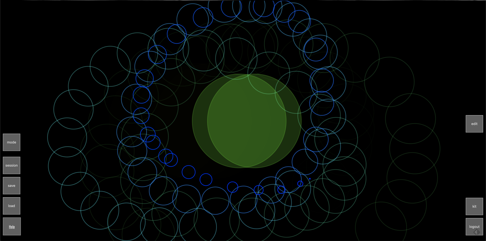
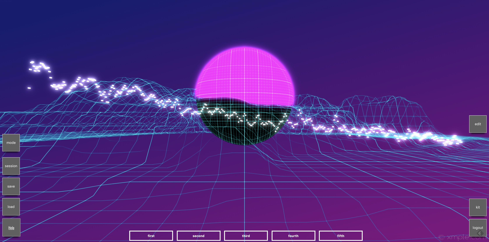

## A4: Wavelength

https://a4-kitzeller.herokuapp.com

Wavelength is a web application that facilitates real-time audio-visual collaboration. It makes use of 
[Hydra](https://github.com/ojack/hydra), [Tone.js](https://tonejs.github.io/), 
[Magenta.js](https://magenta.tensorflow.org/), [Gibber](https://github.com/charlieroberts/gibber.audio.lib), [Babylon.js](https://www.babylonjs.com/), and Canvas2d.
The goal of the app is to allow users to work on live-coding projects together in real-time, without having to be physically 
present. The app allows interaction with pre-existing music/visual libraries, as well as tools and interfaces I created. 
Most of the challenges faced were related to websockets, audio timing, and figuring out when states should be saved, given that multiple
users are editing the same content.
Several challenges arose with using different canvases and contexts, webgl, 2d, etc. As well as having several audio
contexts and sources.

I used the built-in standard ESLint plugin on WebStorm, as well as running Code Inspection. I also used w3 to validate my HTML and CSS files, both
on the website and the WebStorm plugin. I used 'eslint:recommended', adding support for jqeury. I also disabled some of the rules,
like 'no-undef', as they were not happy with some of the js files I had to browserify to use within my app.

I created ES6 modules for the sequencer and the piano. Also, for user interaction, I made use of dat.gui input, mouse movement, 
keypress events, file drag/drop, MIDI input and microphone/camera input. 

To test, you can create an account, or use:

- username: kit
- password: secret

## Technical Achievements
- **Tech Achievement 1**: I created a MIDI File visualizer using d3.js, and added other audio visualizations using canvas2d and babylon.js. The midi
visualizer allows users to drag/drop files onto the page, or select from preloaded midi files on the bottom. The d3 mode allows users to draw sounds,
 where the x-axis alters the frequency and the y-axis alters the amplitude of the sound.
- **Tech Achievement 2**: I improved the RNN model and fixed the midi piano, adding more keys to the piano as well as Dat.GUI support
for changing the piano attack and release, as well as the rnn step number and temperature (randomness).
- **Tech Achievement 3**: I updated the sequencer to give it two modes, a "synth" mode and a "drum" mode. The synth mode
produces sounds from Tone.js synths, whereas the drum mode allows users to toggle between various drumkits, like analog, electronic, percussion, dubstep and hiphop
using the "change" button, which is only enabled when the user is in drum mode.

### Design/Evaluation Achievements
- **Design Achievement 1**: I added more custom Hydra.js patterns to the "random" button in "hydra" mode.
- **Design Achievement 2**: I designed all the audio visualizations as well as the d3 midi visualisers and reactive synth instrument.
- **Design Achievement 3**: I designed the interaction for switching the drum pad mode from synth to drumkit.
- **Design Achievement 4**: I updated the edit mode capabilities, allowing users to move around more of the UI, like the button columns on the 
left and right of the screen.
- **Design Achievement 5**: I tested my application on several people, making modifications to the UI/UX accordingly.
