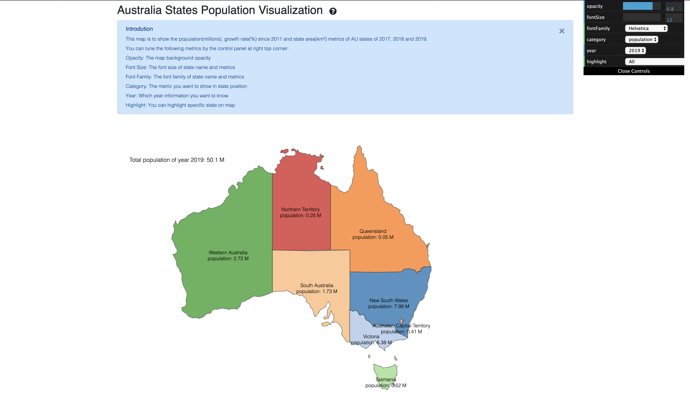
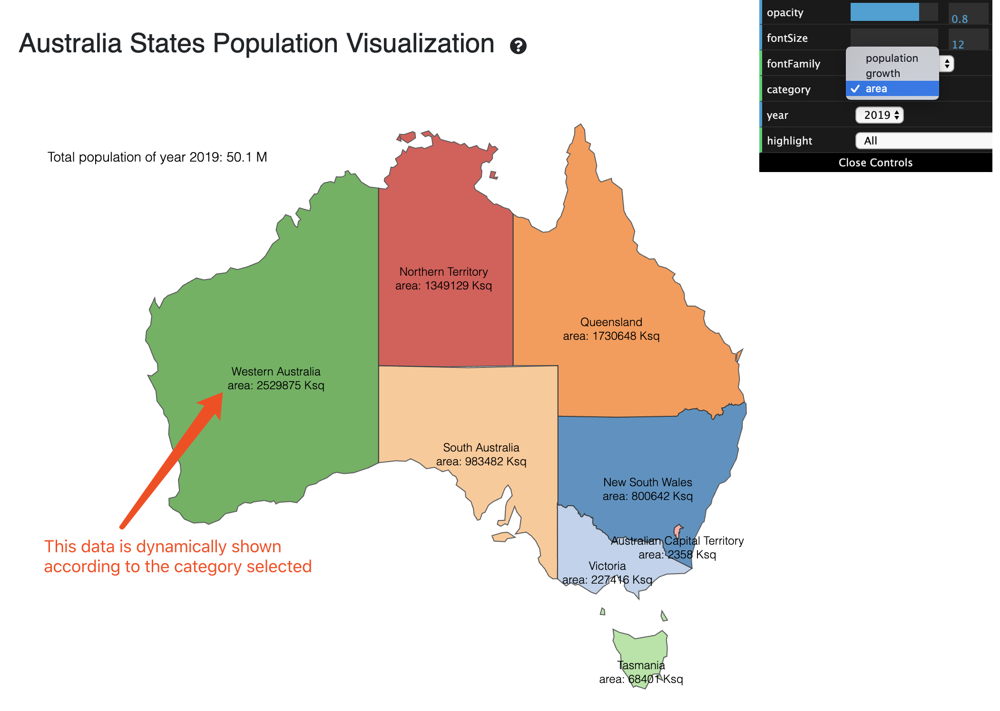
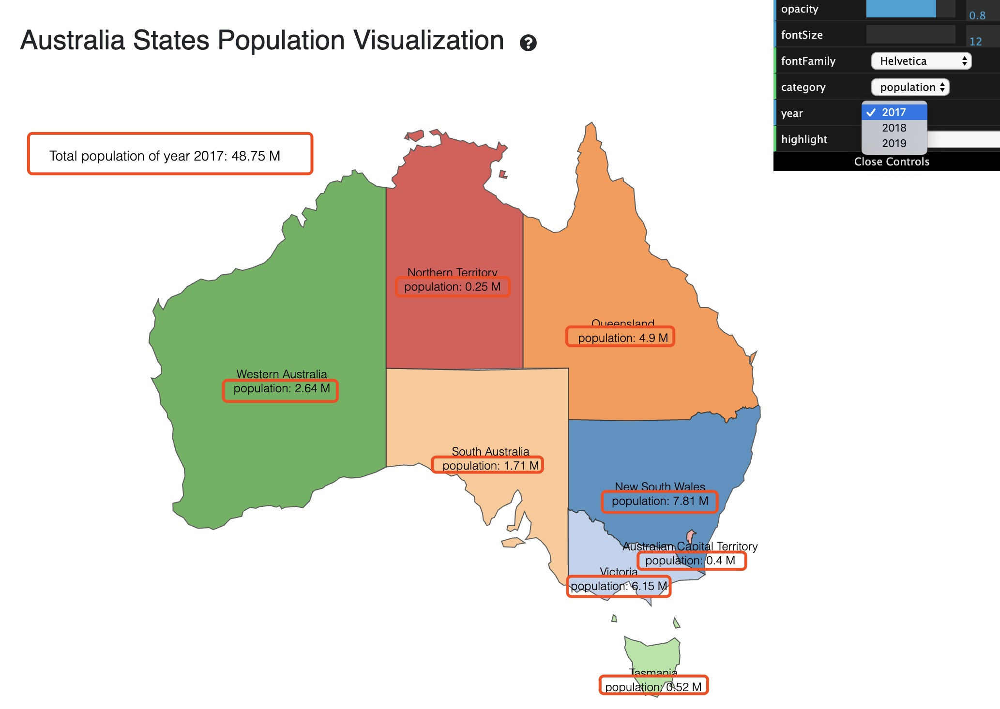
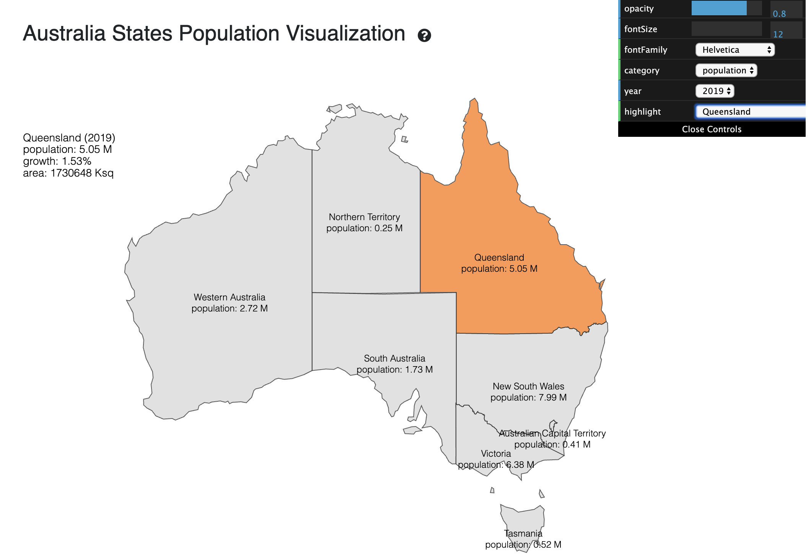

Assignment 4 - Creative Coding: Interactive Multimedia Experiences
===
## Australia States Population Visualization

Hosting link: http://a4-charlieroberts.glitch.me

### Introduction

This project aims to display the population of Australia states, including the population of each state, the growth rate since 2011 and the state area which is used to evaluate the population density.

This map is to show the population(millions), growth rate(%) since 2011 and state area(km²) metrics of AU states of 2017, 2018 and 2019.


### Challenges
The main challenge is how to display the map and show the corresponding on it, additionally, it also needs to be controlled by GUI panel.

### JS linter
In this project, it is implemented by VS Code and enable ESLinter plugin, the following rule is used:
```json
"rules": {
    "semi": ["error", "always"],
    "quotes": ["error", "double"]
}
```

## Technical Achievements
- **Tech Achievement 1**: Use D3.js library to implement map visualization with geo json data for Australia states.
- **Tech Achievement 2**: Use dat.GUI to make user interactive friendly and allow users to adjust the data and map display.
- **Tech Achievement 3**: To provide responsive UI, I use Bootstrap V4 and font-awesome to prettify the webpage.
- **Tech Achievement 4**: Give a guideline to users and it can be closed and reopened by binding javascript events.
- **Tech Achievement 5**: Implement two modules in `geo.js` and `population.js` to read geography and population data and imported as controller for URL request handling.
- **Tech Achievement 6**: Flexible to use js bind and events to correspond to user interactive events, such as mouse moving events to show/hide tooltip when it moves on map.

### Design/Evaluation Achievements
- **Design Achievement 1**: Use Bootstrap to dispaly the page in responsive container.
- **Design Achievement 2**: Clear code structure with custom js and css file without any embeded style and script code.
- **Design Achievement 3**: Besides meet visualization requirements, it also provides simply data analysis feature, like summerize total population of Australia.

### User Guide
#### Show state data on map by selecting category
As it provides population, growth rate and state area, 3 kinds of data, it can be selected by the dropdown box on control panel.



#### Show data for different year
You can also change the year to see the population data for the selected year.



#### Highlight the state 
Select one state you want to highlight, it shows the detailed data on the left top corner and fade other states and it can return to all states display.



#### Adjust style attributes for map color opacity and text
The other parameters on the GUI panel is to tune color opacity and font for the map
