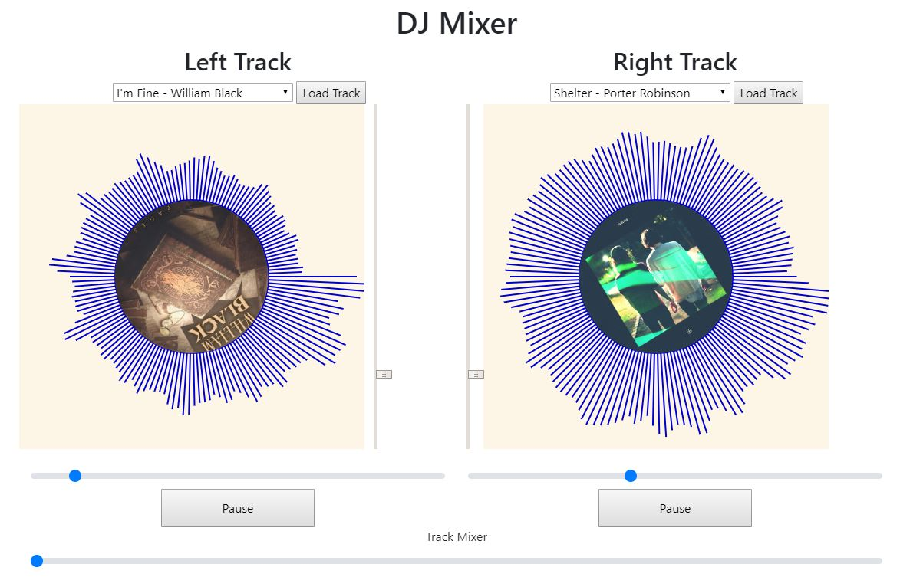

Assignment 4 - Creative Coding: Interactive Multimedia Experiences
===

Due: September 27th, by 11:59 PM.

## DJ Mixer

https://a4-mhwestwater.glitch.me/

This project is a simple DJ mixing board with audio visualization. It allows users to load in up to two tracks at a time and change volume, location in track, and playback speed. This allows the user to fade back and forth between tracks. This is indented to serve as a fun game to play with mixing musical tracks together.

There were some difficulties with structuring the application to allow for making the code modular between the two sides of the mixer. After some updates it was able to be made into a module which allowed for shared code for both sides. There were also issues with initializing the audio source, and needed to be resolved by initializing the audo after the user had first interacted with the app.

Linting and validation was done in WebStorm. This was a combination of their default linting parameters and ESLint. Semicolons were enforced. HTML and CSS were validated using both the internal WebStorm tools and online W3C checkers. The only issues found were custom parameters added to the slider which the online validators weren't able to catch because they didn't look at HTML with CSS.

## Parameters Exposed to User
A total of 9 parameters are exposed to the user, 4 for each track and the common volume slider.

- Parameters for each track
  - Song selection to load
  - Speed control
  - Time scrubbing
  - Play/Pause
- Common volume slider

## Technical Achievements
- **Tech Achievement 1**: Utilized modules to create portable code to function in multiple canvas elements with the same code base. Allowing for easily adding the two visualization elements.
- **Tech Achievement 2**: Linked track speed with rotation speed of the album cover like a real record.
- **Tech Achievement 3**: Implemented callbacks for audio progress bar to both display current state and allow the user to scrub through the file.

### Design/Evaluation Achievements
- **Design Achievement 1**: Verified to run on Chrome, Firefox, and mobile Chrome
- **Design Achievement 2**: Play tested with more musically inclined friends to confirm that its kinda cool but overall very hard to make anything useful.
  - It was found to be a lot more fun on a touch screen laptop or tablet
- **Design Achievement 3**: Integrated album art into records for better visualization of current track playing.
