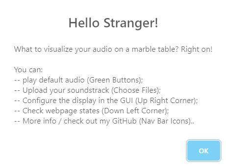
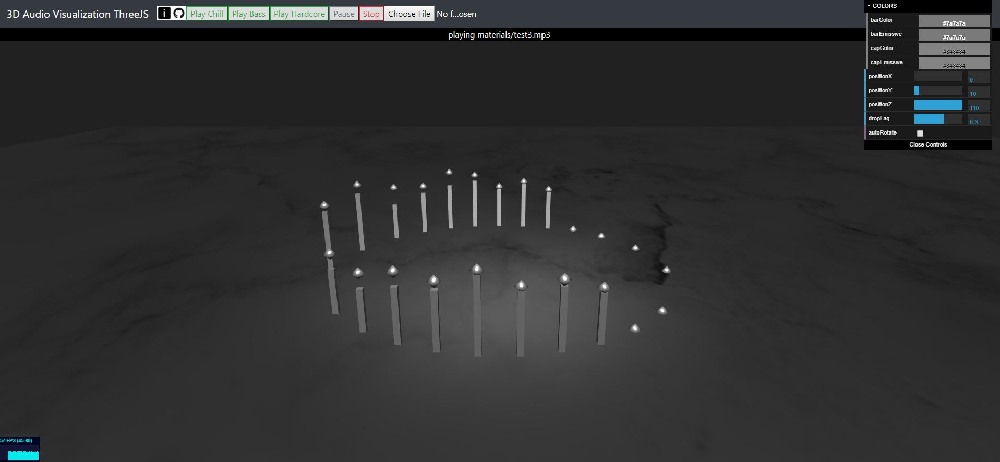

##  Assignment 4 - 3D Audio Visualizer Three JS
---

##### Figure 1: Login Prompt on Usage

#####  Figure 2: 3D Visualizer UI

###### "A good programmer sometimes sleeps..."

Glitch Hosting link e.g. http://a4-zonglinpeng.glitch.me

## Summary
- Goal: An audio visualizer is designed to display the spectrum audio wave in a 3D space. In my design, the display is a metalic-like bars with caps on a marble interface.
- Challenges:
    1. Build a nice 3D plane using three.js;
    2. Read the soundtrack from either defaults or from user uploads;
    3. Parse sound wave, and change the properties of the bars conrespondingly
    4. Refactor js into modules.
- JS linter: passed all validations in VSCode; Error messages from Standard (npx standard file) explained as below:
    - server.improved: pass
    - js in modules: 
        - conflict with VSCode "Expected indentation of 2 spaces but found 4."
        - xxx.min.js not recongized by linter "xxx is not defined".
        - Other: trivial and too many to fix within the given time.
    - HTML and CSS are validate by VSCode.

## Requirements
- Server: express server using compression, helment, falvco, and body-parser.
- Three.js and Web Audio API are adopted for displaying graphic and play soundtracks.
- GUI: dat.gui with 9 attributes.
- Basic documentation: alert upon entering the web; info upon clicking the exclaimation icon.
- Modules: three modules (js) for setup, loading scene, and construct the GUI.
- Linter: passed all variations in VSCode; some issues from Standard Linter which are explained below.
- HTML and CSS are validated by VSCode.

## Technical Achievements
- **Spectrum Display**: the bars are displayed according to the sound wave of the music, where the left-most of the circle is the low frequency, and the right-most is the high frequency. Cap-balls drops after they are pushed up by the bars.
- **Interactable Play Buttons**: The music can be paused, resumeds, and stopped anytime
- **Parse Music File by XML**: A get request is sent to get the sound source.
- **Drag Drop Audio File Upload**: User can upload music file to the web and the player will parse the music file and play it. Uploading can be done by either the button or dragdrop.
- **Multiple Attributes in DAT DUI**: Color of the bars and caps can be changed; camera can auto-rotate; drop speed of the caps can be varied.

## Design/Evaluation Achievements
- **Interactable Display Interface**: User can either use mouse or scroll, or the GUI, to adjust the camera of the display interface; a peek or a detailed look.
- **Live Message**: a message bar is implemented at the top of the screen whose messages are stored and updated in the infoContainer.
- **Metalic Sound Bar**: Sound bars and caps are displayed in the similar texture to metal, which can also be adjusted in the GUI.
- **User Alert**: Used sweet alert so that users get notified when entering the website or click on the info icon.
- **States Display**: a States is displayed at the bottom of the webpage.
